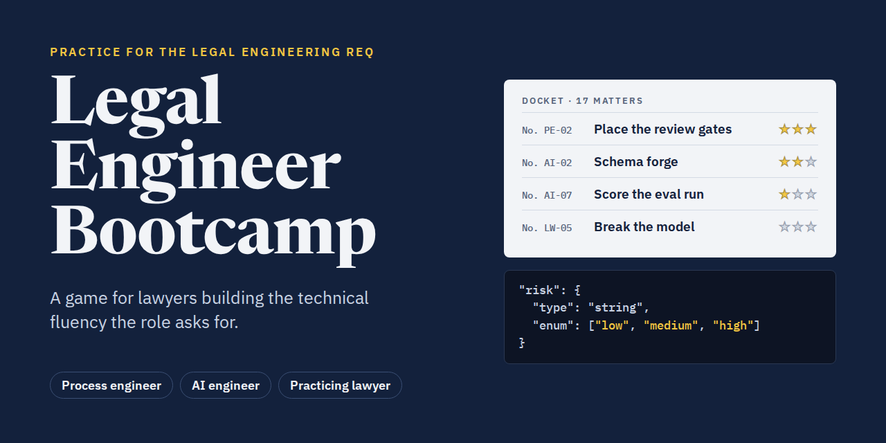

# Legal Engineer Bootcamp



A practice game for lawyers building the technical fluency a legal engineering role asks for.

**Play it:** https://nkostelnik.github.io/learn-legal-engineering/

Inspired by [Ted Theodoropoulos's post](https://lnkd.in/p/gBuHK8CW) breaking down what a Legal Engineering Attorney job req really asks of one person.

## Why it exists

Ted's analysis of an Am Law 100 Legal Engineering Attorney job description shows the req asks one person for three skill sets:

| Role | What the req asks for |
| --- | --- |
| Process engineer | Lean Six Sigma thinking. Decompose workflows into tasks, review gates and exceptions. |
| AI engineer | Write prompts, JSON Schemas, retrieval setups and evaluation suites. |
| Practicing lawyer | A J.D. and practice experience. Supply the playbook, the fallback positions and the house style. |

Legal Engineer Bootcamp gives you a level for each of those lines. Every level uses NDA work and starts with a short brief. Then you do a hands-on exercise and get a score of up to three stars.

## The docket

Levels are numbered like docket entries.

### Process engineer

| No. | Level | You practice |
| --- | --- | --- |
| PE-01 | Map the NDA workflow | Breaking a workflow into ordered steps |
| PE-02 | Place the review gates | Deciding what to automate, gate or route as an exception |
| PE-03 | Write the exception trigger | Writing routing conditions on model output fields |
| PE-04 | Hunt the waste | Lean wastes (DOWNTIME) and process cycle efficiency |

### AI engineer

| No. | Level | You practice |
| --- | --- | --- |
| AI-01 | Prompt anatomy | Building a prompt against a six-case test suite |
| AI-02 | Schema forge: clause extraction | Editing a JSON Schema: `enum`, `required`, `additionalProperties` |
| AI-03 | Schema forge: obligations | Nested schemas, `items`, `pattern`, `minLength` |
| AI-04 | Pattern match the durations | Regular expressions with capture groups |
| AI-05 | Retrieve the right rule | Choosing passages for retrieval-augmented generation |
| AI-06 | Read the API call | Request and response fields, truncation, token cost |
| AI-07 | Score the eval run | Precision and recall against gold labels |
| AI-08 | Compare prompt versions | Finding regressions case by case |

### Practicing lawyer

| No. | Level | You practice |
| --- | --- | --- |
| LW-01 | Apply the playbook | Sorting positions into preferred, fallback and escalate |
| LW-02 | Turn the memo into a rule | Turning a partner's memo into an explicit rule |
| LW-03 | Build the fallback ladder | Ordering liability positions from opening ask to walk-away |
| LW-04 | Design the edge cases | Choosing the eval cases that find the most bugs |
| LW-05 | Break the model | Writing eval cases that expose three buggy builds |

Also in the game:

- **Interview lines.** Each finished level gives you a one-paragraph answer you can say in an interview. They collect in an "Interview prep" list on the home screen.
- **Glossary.** 40 terms, searchable, linked from every level.
- **Progress.** Stars are saved in your browser's local storage, so nothing leaves your device.

## Run it locally

There's no build step and nothing to install. Open `index.html` in a browser, or serve the folder:

```sh
python3 -m http.server 8000
# then open http://localhost:8000
```

## How it's built

The game is one file, `index.html`, with plain HTML, CSS and JavaScript. The only external resources are Google Fonts. All level content is in the `TRACKS` and `MORE` arrays near the top of the script. Each level names an exercise type in its `kind` field:

| `kind` | Exercise |
| --- | --- |
| `order` | Tap items into sequence |
| `classify` | Sort each item into a bucket |
| `select` | Pick exactly *k* options |
| `quiz` | Multiple choice and numeric answers |
| `prompt` | Toggle prompt components and run tests |
| `schema` | Edit a JSON Schema, checked by a built-in validator |
| `regex` | Write a pattern and test it on sample lines |
| `trigger` | Build OR-joined routing conditions |
| `rule` | Fill in a structured rule from a memo |
| `break` | Write eval cases against hidden buggy builds |

To add a level, add an object to `MORE` with a `track`, an `id` and a `kind`, plus the fields that exercise type needs. Then list its `id` in `ORDER` where it should appear in the docket. Add an `interview` line and `terms` that exist in `GLOSSARY`.

## Social preview

`social-preview.png` (1280×640) is the image used when the game is shared, and the README header image. To use it on GitHub as well, upload it under the repository's **Settings → General → Social preview**.
